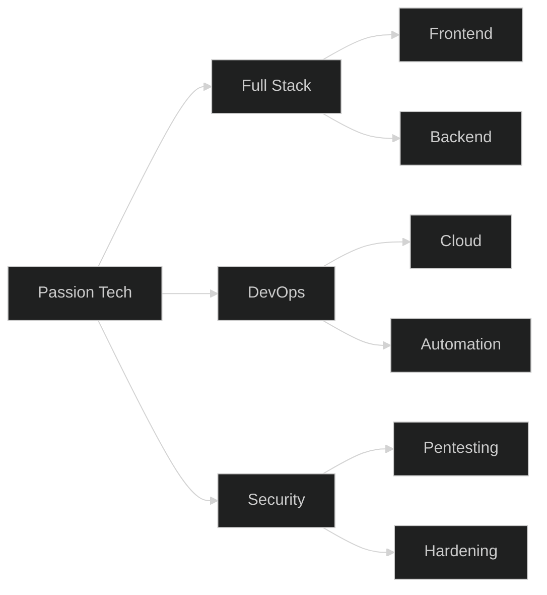

<!-- Header Animé -->

  
  
  <h3>
    
  </h3>
  
  

     
    
    
  

<!-- Section À Propos avec GIF -->
## 🚀 À Propos de Moi

**Développeur Full Stack Senior** spécialisé dans les architectures cloud-native et les pratiques DevSecOps. Passionné par :

| Passion | Description | 
|---------|-------------|
| 🏗️ **Conception** | Systèmes distribués robustes et évolutifs |
| 🔐 **Sécurité** | Intégration dans le cycle de vie (SDLC) |
| 🤖 **Automatisation** | Workflows intelligents et CI/CD avancés |
| 🌍 **Open Source** | Solutions pour le marché africain |

**Fonctions clés** :

| Poste | Organisation | Emoji |
|-------|-------------|-------|
| Architecte Solutions | @ Zone01 Dakar | 🏢 |
| CTO | @ HASTECH GROUP | 👨‍💻 |
| Mentor Technique | @ Google Developer Groups | 🎓 |

<!-- Version alternative avec badges -->

  
  

## 🛠️ Stack Technique Complète

<b>📌 Cliquez pour voir mon stack complet</b>

### 🌐 Frontend

### ⚙️ Backend

### 🛡️ Sécurité

### ☁️ Cloud & DevOps

### 🗃️ Bases de Données

## 📊 GitHub Analytics Avancés

